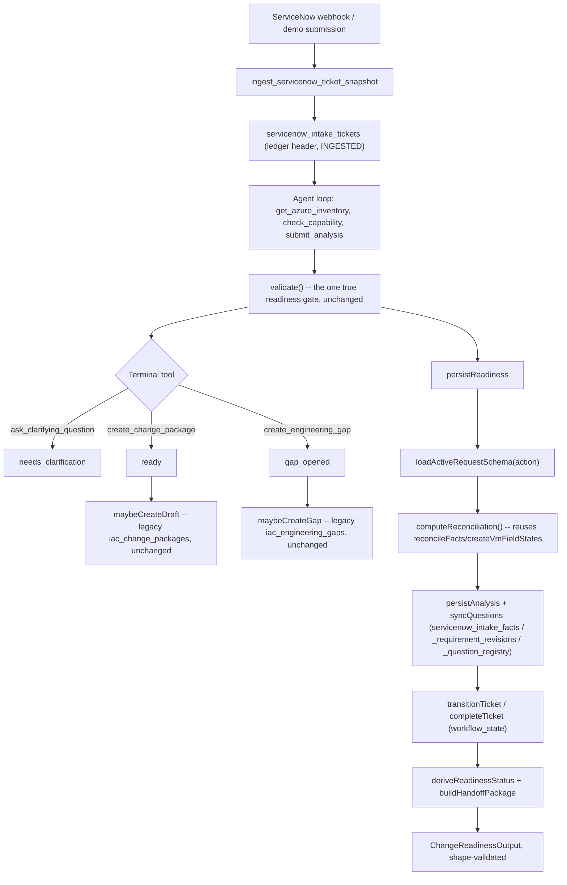

# ServiceNow Change Readiness Agent

`supabase/functions/servicenow-intake-agent` was rewritten in place to close
a real gap: the ticket ledger added by the `20260911173047`-series migrations
(`servicenow_intake_tickets`, `_facts`, `_requirement_revisions`,
`_question_registry`, `iac_request_schemas`, ...) had no producers. Facts,
questions, and requirement revisions were never written; `workflow_state` was
set once to `INGESTED` and never advanced; `iac_request_schemas` had no way
to insert a new version. Every real decision still ran on the legacy
`servicenow_intake_requests.status` column and an in-memory-only
`validate()` call, discarded after each response.

This agent keeps that decision path **exactly as it was** (see
[servicenow-intake-agent.md](servicenow-intake-agent.md)) and adds a second,
additive concern: after each analysis, mirror it into the durable ledger with
full field-level provenance, drive `workflow_state` forward through the
ledger's own guarded RPCs, and return the result as a structured,
shape-validated JSON contract. The ledger **observes** the decision; it never
gates it. `validate()` remains the sole authority for whether a governed
change package or engineering gap is created.

## Scope

**Azure only.** No AWS/GCP validation exists anywhere in the backend (they
appear only as frontend demo/mock data under `src/pages/agentic-iac/`).

**Reuses the live Terraform pipeline, unchanged.** `create_change_package`
and `create_engineering_gap` still call the same `maybeCreateDraft`/
`maybeCreateGap` functions, writing to the same `iac_change_packages`/
`iac_engineering_gaps` tables as before. The five ticket-scoped
`iac_ticket_engineering_gaps`/`_terraform_packages`/`_static_validation_runs`/
`_github_commit_observations`/`_draft_pull_requests` tables described in
[servicenow-terraform-change-agent.md](servicenow-terraform-change-agent.md)
stay permanently unused — no code in this agent writes to them. That
document's "isolated Terraform generation" and "ticket-specific GitHub draft
PR" phases are not implemented here and are not on this agent's roadmap; this
work only closes its "durable fact-extraction and question-resolution
transactions" gap, for the parts that matter to readiness (not to Terraform
drafting).

**Rewritten in place.** Same function slug, same disabled-by-default rollout
posture. `supabase/functions/servicenow-intake` (the live one-shot function)
is untouched — it does not import from `_shared/servicenow-intake-agent-core.ts`
or `_shared/servicenow-change-readiness-core.ts` and cannot be affected by
anything in this document.

## Architecture

`persistReadiness` (in `agent-loop.ts`) runs once per agent run, after the
model's terminal tool call (or the turn-budget/gateway-error fallback) has
already decided the outcome. It never influences that decision — by the time
it runs, `maybeCreateDraft`/`maybeCreateGap` have already executed or not.

## Data model

All tables below already existed (`20260911173047` through `20260911174034`,
plus a `20260911180722` bugfix); this work added only the RPCs that write to
them (`20260914120000`, plus two catalog-seeding bugfix migrations,
`20260914121500` and `20260915010000`) and the TypeScript that calls them.

| Table | Written by | Purpose |
|---|---|---|
| `servicenow_intake_tickets` | `ingest_servicenow_ticket_snapshot` (header), `transition_servicenow_intake_ticket`/`complete_servicenow_ticket_request` (state) | One row per permanent ticket conversation; `workflow_state` + optimistic `workflow_version`. |
| `servicenow_intake_ticket_events` | `record_servicenow_ticket_analysis_event` | One append-only row per analysis attempt; facts attach to it via `source_event_id`. |
| `servicenow_intake_facts` | `record_servicenow_ticket_facts` | One row per reconciled field per analysis attempt: value, `source_type`, `source_occurred_at`, `confidence` (0-1), `precedence_rank` (the real `SOURCE_WEIGHT` that won reconciliation), `validation_status`. Deduplicated on `(ticket_id, source_event_id, canonical_field, value_sha256)`. |
| `servicenow_intake_requirement_revisions` | `record_servicenow_requirement_revisions` | Append-only per-field history; a new revision is written only when `field_state`, `selected_fact_id`, or `explanation` actually changed. `complete_servicenow_ticket_request` reads this table's latest row per required field to gate completion. |
| `servicenow_intake_question_registry` / `_question_events` | `sync_servicenow_question_registry` | The durable backing for `shouldAskForField()`'s in-memory guarantee: an `OPEN` question is never re-asked; an `INVALID` one always is. |
| `iac_request_schemas` | `create_servicenow_request_schema_version` (new version) + `activate_servicenow_request_schema` (existing) | The versioned, admin-editable requirement catalog (see below). |

## Requirement catalog

`iac_request_schemas.schema` is `{ requiredFields: string[], requiredApprovals: string[], automationSupported: boolean }`,
one active row per `request_type`. Seeded for all 9 real `SUPPORTED_ACTIONS`
(`start_vm`, `stop_vm`, `restart_vm`, `resize_vm`, `increase_os_disk`,
`configure_backup`, `enable_monitoring`, `assess_patches`, `create_vm` —
`requiredFields` mirrors exactly what `validate()` already checks for that
action, `automationSupported: true`) plus 10 non-automated categories and
`unknown` (the spec's common-fields checklist only, `automationSupported: false`).
`loadActiveRequestSchema` falls back to an in-code generic schema (logged as
an error) if a `request_type` somehow has no active row — it never proceeds
with zero requirements.

**To add or change a requirement list:** call
`create_servicenow_request_schema_version(request_type, schema, actor, idempotency_key)`
to insert the next version as inactive, then `activate_servicenow_request_schema`
to switch it live. Both are `SECURITY DEFINER` RPCs gated by
`assert_servicenow_agent_service_role()` — call them from server code with a
service-role session, never from a migration (migrations run as `postgres`
with no `service_role` JWT, so this check would reject them; a migration
seeding data must use raw `INSERT`/`UPDATE` plus
`set_config('app.servicenow_agent_registry_activation', 'on', true)` instead,
matching `20260914120000`'s and `20260915010000`'s own seed blocks). Schema
content and `request_type` are immutable once inserted
(`enforce_iac_request_schema_immutability`) — there is no in-place edit, only
a new version.

`automationSupported` means "this platform's `validate()` has real,
bespoke field validation for this action" — it is unrelated to whether a
specific Terraform *capability* is currently approved, which
`check_capability`/`iac_automation_capabilities` still answer dynamically per
request. A category can be `automationSupported: true` and still route to
`create_engineering_gap` if no capability happens to be approved yet.

## State machine and readiness status

`servicenow_intake_tickets.workflow_state` is the DB-enforced
`WorkflowState` (`_shared/servicenow-change-agent.ts`'s `WORKFLOW_TRANSITIONS`
mirrors the SQL functions' own transition tables). `deriveReadinessStatus`
is a pure mapping onto the spec's 9-value vocabulary:

| WorkflowState | hasOpenConflicts | hasFailedValidation | ReadinessStatus |
|---|---|---|---|
| `INGESTED` | — | — | `NEW` |
| `ANALYZING` | — | — | `ANALYZING` |
| `WAITING_FOR_INFORMATION` | false | false | `NEEDS_CLARIFICATION` |
| `WAITING_FOR_INFORMATION` | true | any | `CONFLICT_DETECTED` |
| `WAITING_FOR_INFORMATION` | false | true | `VALIDATION_BLOCKED` |
| `REQUEST_COMPLETE` | — | — | `READY_FOR_REVIEW` |
| `GAP_CREATED` / `PACKAGE_GENERATED` / `PACKAGE_VALIDATED` / `DRAFT_PR_CREATED` | — | — | `READY_FOR_CLOUD_TEAM` |
| `HANDOFF_COMPLETE` | — | — | `ROUTED` |
| `BLOCKED` | — | — | `VALIDATION_BLOCKED` |
| `FAILED` | — | — | `CANCELLED` |

This agent can only ever reach `REQUEST_COMPLETE` — the `GAP_CREATED`
onward states are reachable only through the ticket-scoped Terraform RPCs
this agent deliberately never calls (see Scope, above), so
`READY_FOR_CLOUD_TEAM`/`ROUTED` are correct-but-currently-unreachable outputs
of a total function, not evidence of missing wiring.

`persistReadiness` (in `agent-loop.ts`) drives the transition, guarded by the
already-exported `transitionAllowed()` before every call so an illegal
transition (e.g. a ticket that is already `REQUEST_COMPLETE`) is a safe
no-op rather than a thrown error:

1. Advance `INGESTED` / `WAITING_FOR_INFORMATION` / `BLOCKED` / `FAILED` →
   `ANALYZING` (covers both a ticket's first analysis and a resume-queue
   reprocessing after clarification or a capability approval).
2. `outcome.kind === "blocked"` (an in-flight change already targets this
   resource) → `ANALYZING` → `BLOCKED`.
3. `ready` or `gap_opened` outcome, every catalog-required field `VALID`,
   and an active schema exists → `complete_servicenow_ticket_request`
   (`ANALYZING` → `REQUEST_COMPLETE`). A `gap_opened` outcome completes the
   ledger request too: "complete" means the *information* is valid, which is
   independent of whether a Terraform capability happens to exist yet.
4. Otherwise, still `ANALYZING` → `WAITING_FOR_INFORMATION`.

Every transition's idempotency key is derived from a hash of this analysis
attempt's content plus the version being transitioned from — a genuine retry
(webhook redelivery, resume-queue retry) of identical content reuses the same
key and safely no-ops; different content always gets a new key.

## Structured output contract

Every agent run returns a `ChangeReadinessOutput`
(`_shared/servicenow-change-readiness-core.ts`), included in the HTTP
response (`readiness` field) alongside the existing status/outcome fields.
`validateChangeReadinessOutput` checks its shape before it is trusted
anywhere; a violation is logged as a `readiness_output_contract_violation`
event rather than silently returned. Key fields: `missingFields`/
`invalidFields`/`conflicts` (from the same per-field revisions written to the
ledger), `validationResults` (system-checked facts: Azure target match,
capability approval — `NOT_VALIDATED` when there is nothing to check against,
never a fabricated pass), `handoffPackage` (the spec's requester-fact vs.
agent-recommendation-tagged package, built only once `readinessStatus` is
`READY_FOR_REVIEW`/`READY_FOR_CLOUD_TEAM`/`ROUTED`), and `terraformEligibility`
(true only when the category is automation-supported, every field is valid,
**and** the outcome was a real `ready`, not just complete information).

Persistence failures degrade this output rather than failing the request:
`persistReadiness` never throws. A ledger write error is logged
(`readiness_persistence_failed`) and the returned output falls back to a
status derived from the outcome alone, with `terraformEligibility.eligible: false`.

## Known, deliberate scope trims

- **`servicenow_intake_fact_conflicts`/`_conflict_members` are not written.**
  `complete_servicenow_ticket_request`'s own completion gate already checks
  `requirement_revisions.field_state != 'VALID'` for every required field —
  a `CONTRADICTORY` field already blocks completion through that path, making
  a separate open-conflicts table redundant defense-in-depth rather than the
  only safeguard. `computeReconciliation` still detects and reports
  conflicts in the structured output (`conflicts`, `readinessReason`); they
  are just not mirrored into their own ledger table.
- **`validate()` was not made catalog-driven.** Rather than modify the
  shared, tested `validate()` (imported by the untouched legacy
  `servicenow-intake` too), `computeReconciliation` is a parallel engine that
  answers the same question using the same underlying deterministic checks
  (`reconcileFacts`, `createVmFieldStates`, `requestedOsDiskSizeGb`), keyed
  off the catalog's field list instead of a hardcoded one. For the 9 real
  actions the two now agree field-for-field (verified directly against
  `validate()`'s source and fixed in `20260915010000` after the initial
  catalog seed omitted `description` everywhere and `maintenanceWindow` for
  `create_vm`). `validate()` remains the sole gate for actually creating a
  change package or gap.
- **The model's classification taxonomy was not broadened** beyond the 9
  real `SUPPORTED_ACTIONS` (+ `unknown`), even though the catalog itself
  covers the spec's full category list. `validate()`'s target-VM-matching
  requirement is VM-shaped and does not generalize to, say, a network
  change with no target VM — broadening classification without first
  redesigning that requirement would strand non-VM tickets asking for an
  unsatisfiable "target VM" field. The `unknown` catalog row (common fields
  only, `automationSupported: false`) already gives every non-VM category
  the spec's "generic checklist, route to a human" behavior today, via the
  existing, tested `sanitizeAnalysis` fallback. The other 9 non-automated
  catalog rows are seeded and ready for a future, deliberate broadening.

## Threat model

Inherits everything in [servicenow-intake-agent.md](servicenow-intake-agent.md#safety-mechanisms-specific-to-the-agent-loop)
(prompt-injection framing, turn cap, capability-defaults-to-unapproved). New
surface this work adds:

- Every new table this agent writes to (`servicenow_intake_facts` and
  siblings, `iac_request_schemas`) is `REVOKE ALL FROM PUBLIC, anon,
  authenticated, service_role` with `SELECT` granted back — even this
  agent's own `service_role` connection cannot `INSERT`/`UPDATE` these
  tables directly. Every write goes through a `SECURITY DEFINER` RPC gated
  by `assert_servicenow_agent_service_role()`, so a bug in this agent's own
  code cannot bypass provenance or the workflow state machine with raw DML.
- `record_servicenow_ticket_facts` persists whatever the model extracted
  into `extractedFields`/provisioning as fact *values* with `source_type`
  reflecting where they came from (`requester_prose`, `structured_ticket`,
  ...) — this is the same untrusted-data boundary the agent loop's system
  prompt already establishes; nothing new is trusted here that validate()
  did not already treat as untrusted.
- Catalog rows are content-immutable once inserted
  (`enforce_iac_request_schema_immutability`) and toggling `active` requires
  the same session-local guard the original migration's activation RPCs use
  — an admin cannot silently rewrite what "ready" means for a live request
  type without it showing up as a new, auditable version.

## Runbook

- **A ticket is stuck in `WAITING_FOR_INFORMATION`:** query
  `servicenow_intake_requirement_revisions` for that `ticket_id`, latest
  `revision_number` per `canonical_field` — any row with `field_state !=
  'VALID'` and its `explanation` names exactly what is missing/invalid/
  contradictory. Cross-reference `servicenow_intake_question_registry` for
  what was actually asked and whether it has an `OPEN` or `INVALID` status.
- **A ticket never left `INGESTED`:** the agent function either never ran
  for it, or `persistReadiness` failed before its first `advance()` call —
  check `servicenow_intake_events` for a `readiness_persistence_failed`
  entry against its legacy `request_id`.
- **`complete_servicenow_ticket_request` keeps failing with "ticket is not
  ready for completion":** the ticket is not in `ANALYZING` when completion
  is attempted (check `servicenow_intake_tickets.workflow_state` directly) —
  most often a version race; `completeTicket`'s `{ok:false, retry:true}`
  result means the caller should re-read the header and retry, which
  `persistReadiness` does not currently loop on (a single attempt per run;
  the next agent run naturally retries).
- **Adding a new requirement to an existing action type:** see Requirement
  catalog, above — insert and activate a new schema version; never edit a
  row in place.

## Tests

- `_shared/servicenow-change-readiness-core.test.ts`: `deriveReadinessStatus`'s
  full truth table, `computeReconciliation` (complete/missing/conflicting/
  invalid fields, and a determinism check the idempotency keys depend on),
  `validateChangeReadinessOutput`, `validateAzureTarget`/`validateCapability`,
  catalog loading (seeded + fallback), and `persistAnalysis`/`syncQuestions`
  call-shape assertions against a fake Supabase client (content-derived
  idempotency keys, real `SOURCE_WEIGHT` precedence, correct question-status
  mapping).
- `servicenow-intake-agent/agent-loop.test.ts`: `persistReadiness`'s
  end-to-end branching against a small stateful fake admin that enforces the
  same expected-version and `ANALYZING`-only-for-completion rules the real
  RPCs do — a first-time `ready` run reaching `REQUEST_COMPLETE`, a **resume
  from `WAITING_FOR_INFORMATION` also reaching it** (the bug this test is
  named for: an earlier draft only handled `INGESTED` as a starting state),
  a `blocked` outcome landing on `BLOCKED`, a missing-catalog-schema case
  never attempting completion, and persistence failures degrading rather
  than throwing.
- Existing `tools.test.ts`/`handler.test.ts` (23 tests, all still green) were
  extended only where their fixtures needed a `canonicalTicketId`/`readiness`
  default; their own assertions are unchanged.
