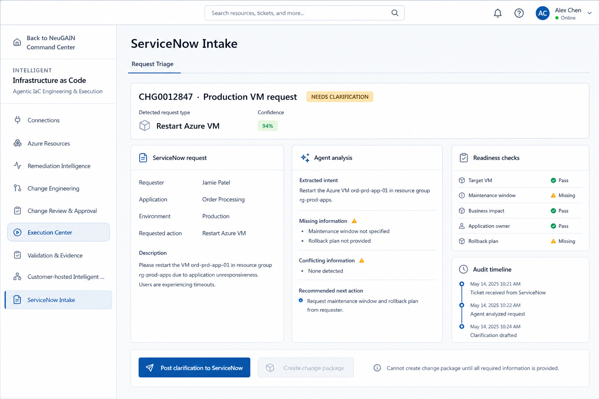

# ServiceNow Intake / Request Triage

## Purpose

This is the design reference for the planned generalized ServiceNow catalog intake experience. ServiceNow sends a general request to the platform, where an agent classifies the request and a deterministic readiness layer checks whether it contains the information required for the requested infrastructure workflow.

## Design reference



## Proposed workflow

```text
ServiceNow ticket
  -> agent classification and field extraction
  -> request-type checklist and policy validation
  -> Azure / CMDB / reference-architecture enrichment
  -> clarification or ready-for-engineering
  -> governed VM change package
```

## UI sections

- ServiceNow ticket number, requester, application, environment, action, and description
- Detected request type and agent confidence
- Extracted intent, missing information, and conflicting information
- Readiness checks for target VM, maintenance window, business impact, application owner, and rollback plan
- Audit timeline for ticket receipt, analysis, and clarification
- Action to post a clarification note back to ServiceNow
- Change-package creation enabled only after required information is complete

## Guardrails

- The agent may classify, extract, explain, and draft clarification questions.
- Deterministic rules decide which fields are mandatory and whether values are valid.
- Azure and CMDB data should be used to prefill and verify technical details.
- Low-confidence or ambiguous requests must go to human clarification rather than being guessed.
- The agent must not approve or execute infrastructure changes.
- ServiceNow remains the system of record for the request and change-management history.

## Initial pilot recommendation

Start with the `Restart Azure VM` request type because the current pilot already supports Azure VM discovery, approval, controlled execution, and post-execution validation. Expand later to VM creation, resize, storage expansion, monitoring, backup, and network workflows.

## Related implementation

The current VM workflow is implemented under `src/pages/agentic-iac/`. The future tab should feed complete requests into Change Engineering and should use the existing approval, execution, and Validation & Evidence flows.
